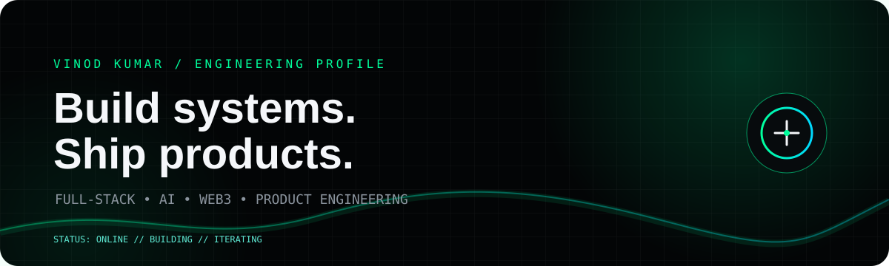

<p align="center">
  
</p>
<p align="center">
  <a href="https://answervinod.com">PORTFOLIO</a>
  &nbsp;&nbsp;•&nbsp;&nbsp;
  <a href="https://www.linkedin.com/in/answervinod/">LINKEDIN</a>
  &nbsp;&nbsp;•&nbsp;&nbsp;
  <a href="https://github.com/answervinod">GITHUB</a>
</p>
<br>
<table width="100%">
<tr>
<td width="58%" valign="top">
`ABOUT`
I’m a Full-Stack Engineer and product builder working across web applications, AI, blockchain and automation.
I like owning the complete path:
`idea → architecture → interface → backend → integration → deployment`
My strongest interest is at the intersection of AI, Web3 and practical product engineering.
</td>
<td width="42%" valign="top">
`FOCUS`
`FULL-STACK`  
`ARTIFICIAL INTELLIGENCE`  
`WEB3 / BLOCKCHAIN`  
`AUTOMATION`  
`SYSTEM DESIGN`  
`PRODUCT ENGINEERING`
</td>
</tr>
</table>
---
`TECH STACK`
<p>

</p>
Also working with: REST APIs · authentication · dashboards · SaaS architecture · AI integrations · local AI experiments · decentralized systems · wallets · Web3 integrations · desktop/mobile application concepts
---
`CURRENTLY BUILDING`
<table width="100%">
<tr>
<td width="50%" valign="top">
`DAGCHAIN`
Decentralized infrastructure / blockchain ecosystem
A larger ecosystem exploring DAG-oriented blockchain architecture, utility and products built around decentralized infrastructure.
`ACTIVE DEVELOPMENT`
</td>
<td width="50%" valign="top">
`DAGGPT`
AI × decentralized technology
Exploring intelligent applications and AI utilities within the broader DAGCHAIN ecosystem.
`R&D`
</td>
</tr>
<tr>
<td width="50%" valign="top">
`DAGARMY`
AI education & community
A practical education initiative focused on helping people build careers around AI.
`BUILDING`
</td>
<td width="50%" valign="top">
`RAVYA`
AI desktop assistant
A Jarvis-style assistant concept designed to become part of the desktop workflow rather than simply another chat window.
`R&D`
</td>
</tr>
</table>
---
`LAB`
PROJECT	DIRECTION	STATE
Vaultix	Web3 wallet / digital assets	`CONCEPT`
DeVision	Decentralized storage	`R&D`
TAM	Local AI / digital twin experiments	`EXPERIMENTAL`
---
`HOW I THINK`
```text
01  Understand the actual problem
02  Design the smallest architecture that can work
03  Build a real version
04  Test it against reality
05  Iterate until it is useful
```
I prefer useful software over impressive demos.
---
`GITHUB / TELEMETRY`
<p align="center">
  
  
</p>
<p align="center">
  
</p>
---
`CONTRIBUTION STREAM`
<p align="center">
  
</p>
---
`THE INTERSECTION`
<p align="center">
AI  
`+`  
WEB3  
`+`  
FULL-STACK  
`+`  
AUTOMATION  
`=`  
PRODUCTS
</p>
The problems I find most interesting are usually between disciplines:
AI + Web3 · AI + Desktop · Web + Decentralized Infrastructure · Automation + Real Products
---
`CONNECT`
<p align="center">
  <a href="https://answervinod.com"><strong>answervinod.com</strong></a>
  &nbsp;&nbsp;•&nbsp;&nbsp;
  <a href="https://www.linkedin.com/in/answervinod/"><strong>LinkedIn</strong></a>
  &nbsp;&nbsp;•&nbsp;&nbsp;
  <a href="https://github.com/answervinod"><strong>GitHub</strong></a>
</p>
<p align="center">
  <sub>BUILD → SHIP → LEARN → REPEAT</sub>
</p>
