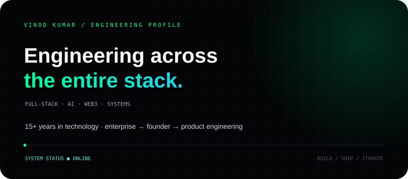
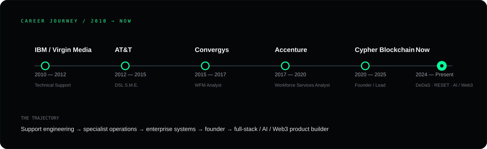

  

  <a href="https://answervinod.com">Portfolio</a> &nbsp;·&nbsp;
  <a href="https://www.linkedin.com/in/answervinod/">LinkedIn</a> &nbsp;·&nbsp;
  <a href="https://github.com/answervinod">GitHub</a>

---

## PROFILE

### Vinod Kumar

**Full-Stack Engineer · Systems Builder · AI / Web3 Product Engineer**

I build software across the entire stack: interfaces, APIs, data, infrastructure, AI integrations and decentralized systems.

My career started in technical support and enterprise operations, moved through specialist and enterprise roles, then into founding and leading blockchain products. Today my work sits at the intersection of **full-stack engineering, AI, Web3 and product systems**.

**Core principle:** turn complicated technology into systems people can actually use.

---

## CAREER JOURNEY

  

| Period | Organization / Chapter | Role |
|:--|:--|:--|
| **2010 — 2012** | IBM / Virgin Media | Technical Support |
| **2012 — 2015** | AT&T | DSL Subject Matter Expert |
| **2015 — 2017** | Convergys | Workforce Management Analyst |
| **2017 — 2020** | Accenture | Workforce Services Analyst |
| **2020 — 2025** | Cypher Blockchain | Founder / Lead Developer |
| **2024 — Present** | DeDaS | Founder / Lead Developer |
| **2024 — Present** | RESET | Product Creator |
| **2024 — Present** | Smart Contract Auditor | Product / Engineering |

---

## WHAT I BUILD

<table>
<tr>
<td width="50%" valign="top">

### FULL-STACK

Modern web applications, APIs, dashboards, SaaS products, authentication, data flows and integrations.

</td>
<td width="50%" valign="top">

### ARTIFICIAL INTELLIGENCE

LLM applications, AI assistants, automation, local AI experiments and AI-powered products.

</td>
</tr>
<tr>
<td width="50%" valign="top">

### WEB3 / BLOCKCHAIN

Blockchain architecture, wallets, decentralized applications, smart contracts and distributed systems.

</td>
<td width="50%" valign="top">

### PRODUCT ENGINEERING

Taking ideas from architecture and prototype through integration, iteration and production.

</td>
</tr>
</table>

---

## SELECTED SYSTEMS

### DAGCHAIN
**Decentralized infrastructure / blockchain ecosystem**

A broader blockchain ecosystem exploring DAG-oriented architecture, decentralized infrastructure and utility-driven products.

### DeDaS
**Decentralized storage**

A distributed-storage direction exploring unused Mac / iOS capacity, peer-to-peer communication and network visualization.

### RESET
**AI Twin × Blockchain**

A product concept combining AI-twin interactions with blockchain-based identity, ownership and economic primitives.

### Smart Contract Auditor
**Security automation**

A product / engineering direction focused on automated Solidity analysis and security workflows.

---

## THE LAB

| Project | Direction |
|:--|:--|
| **DAGGPT** | AI × decentralized technology |
| **DAGARMY** | AI education & community |
| **RAVYA** | Desktop AI assistant |
| **Vaultix** | Web3 wallet |
| **TAM** | Local AI / digital-twin experiments |

---

## TECHNOLOGY

  

  TypeScript · JavaScript · Python · React · Next.js · Node.js · Express · Django · PostgreSQL · MongoDB · Redis · Docker · Linux

---

## ENGINEERING PRINCIPLES

| 01 | 02 | 03 | 04 |
|:--:|:--:|:--:|:--:|
| Understand the problem | Reduce unnecessary complexity | Build against reality | Iterate relentlessly |

> Good engineering is not about using every tool. It is about making the right system work.

---

## GITHUB TELEMETRY

  
  

  

---

## BUILDING NEXT

**AI × SYSTEMS** — practical AI interfaces, automation and local-AI workflows.

**WEB3 × INFRASTRUCTURE** — decentralized systems beyond token speculation.

**PRODUCT × ENGINEERING** — turning ambitious concepts into usable software.

---

  <a href="https://answervinod.com"><strong>answervinod.com</strong></a> &nbsp;·&nbsp;
  <a href="https://www.linkedin.com/in/answervinod/"><strong>LinkedIn</strong></a>

BUILD → SHIP → LEARN → REPEAT

